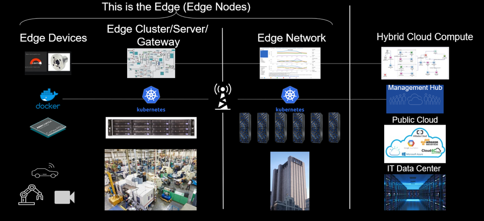
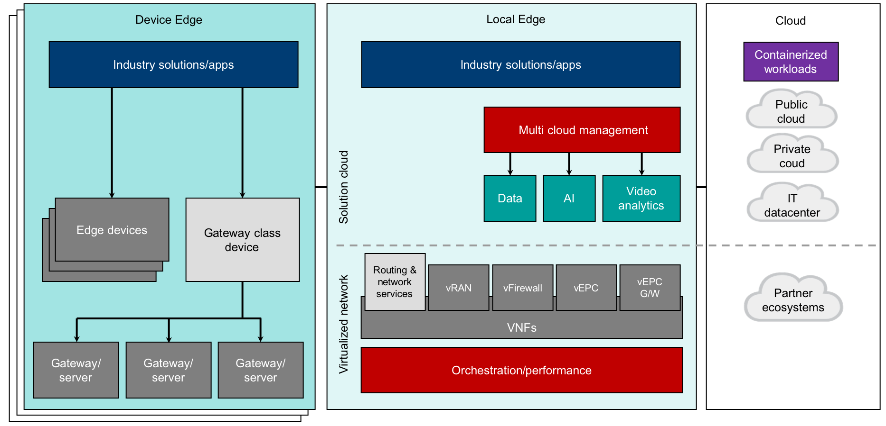

# 边缘计算

## 什么是边缘计算

边缘计算由利用传统和云数据中心之外可用计算资源的技术组成，可使工作负载的所在位置更接近数据的创建位置，并且可以根据数据分析结果及时地采取操作。通过利用和管理可在远程场所（例如工厂、零售店、仓库、酒店、配送中心或车辆）使用的计算能力，开发者可以创建相应的应用程序来实现以下目标：

* 显著减少延迟
* 降低对网络带宽的需求
* 增加敏感信息的隐私性
* 即使网络中断也可正常运作

在将应用程序工作负载移到边缘时，可能需要多个边缘节点，如图所示。

以下是构成边缘生态系统的一些关键组件：

**云**

这可以是公共云或私有云，可以是基于容器的工作负载（如应用程序和机器学习模型）的存储库。这些云还托管并运行用于编排和管理不同边缘节点的应用程序。边缘工作负载（本地和设备工作负载）将与这些云上的工作负载进行交互。云还可以是其他节点所需的任何数据的源和目标。

**边缘设备**

边缘设备是一种专用的装置部件，它同时也具有集成到该设备中的计算能力。在边缘设备上可以执行很多有趣的工作，例如，工厂车间的装配机械、ATM、智能相机或汽车等设备。边缘设备通常受到经济因素的驱动，计算资源一般都比较有限。具有 ARM 或 x86 类 CPU（单核或双核）、128 MB 内存以及 1 GB 本地持久存储器的边缘设备比较常见。尽管边缘设备功能更强大，但目前它们还没有成为规范，而只是作为特例现象存在。

**边缘节点**

边缘节点是指可以在其上执行边缘计算的任何边缘设备、边缘服务器或边缘网关的通用方式。

**边缘集群/服务器**

边缘集群/服务器是位于远程运营设施（例如工厂、零售店、酒店、配送中心或银行）中的通用 IT 计算机。边缘集群/服务器通常由工业 PC 或机架式计算机构成。具有 8 核、16 核或更多核计算能力、16GB 内存和数百 GB 本地存储器的边缘服务器比较常见。边缘集群/服务器通常用于运行企业应用程序工作负载和共享服务。

**边缘网关**

边缘网关通常是边缘集群/服务器，除了能够托管企业应用程序工作负载和共享服务外，还具有可执行网络功能的服务，例如协议转换、网络终止、隧道技术、防火墙保护或无线连接。尽管某些边缘设备可以充当有限的网关或主机网络功能，但是边缘网关通常会与边缘设备分开。

IoT 传感器是固定功能的设备，可收集数据并将其传输到边缘/云，但没有板载计算、内存和存储。因此，无法在其上部署容器。这些边缘设备会连接到不同的节点，但由于它们是固定功能的设备，因此未在图中反映出来。

## 核心优势

边缘计算技术具有以下核心优势：

* **性能**： 在边缘进行近乎即时的计算和分析可降低延迟，从而大大提高性能。随着 5G 的到来，与边缘快速通信成为可能，在边缘运行的应用程序也可以快速响应消费者不断增长的需求。

* **可用性**： 关键系统需要持续运行，而不考虑连接性。当前的通信流程存在许多潜在的故障点。这些故障点包括公司的核心网络、跨多个网络节点的多个跃点及网络路径的安全风险，以及许多其他故障点。对于边缘计算，由于主要在消费者/请求者与设备/本地边缘节点之间进行通信，因而提高了系统的可用性。

* **数据安全**： 在边缘计算架构中，分析数据可能永远不会离开在本地边缘内收集和使用该数据的物理区域。 仅边缘节点需要从根本上予以保护，这更便于管理和监视，也意味着数据更加安全。

## 挑战

### 大规模挑战

如果在您纳入边缘计算时工作负载位置发生变化，并且以更加分散的方式部署应用程序和分析功能，为了进行扩展，就需要使用编排和自动化工具，这样才能在架构上以一致的方式管理此更改。

例如，如果将应用程序从一个具有永续支持的数据中心转移到本地边缘的 100 多个不易访问的位置，或者不在具有这种本地技术支持的位置中，那么管理生命周期和支持应用程序的方式就必须更改。

为了应对这一挑战，就需要使用新工具并对技术支持团队进行培训，以便管理、编排和自动运行这个新的复杂环境。传统网络运营工具对团队来说已经力有不逮（甚至超出软件定义网络运营工具范畴），支持团队将需要别的工具来帮助管理各种分布式环境中网络背景下的应用程序工作负载（远远多于先前），而每个工具都有不同的优势和功能。

### 使工作负载可移植

为了实现大规模运行，就需要对考虑用于边缘计算本地化的工作负载加以修改，从而提高其可移植性。

* 首先，大小很重要。若要减少延迟，就需要将工作负载移至更靠近边缘的位置，而将其移至边缘组件也意味着运行该工作负载的计算资源会减少，因此各种工作负载的总体大小可能会限制边缘计算的潜力。

* 其次，由于要考虑许多不同的工作负载，因此很难采用可移植性标准或标准集。 此外，该标准还应允许管理应用程序从构建、运行一直到维护整个生命周期。

* 第三，需要完成相关工作，确定如何以最适宜的方式将工作负载细分为子组件，从而利用边缘计算的分布式架构。这将允许工作负载的某些部分在边缘设备上运行，而其他部分则在边缘集群/服务器或跨边缘组件的任何其他分布式系统上运行。这通常包括在适用且可行的情况下，迁移至网络功能虚拟化（针对网络工作负载）和容器工作负载（针对应用程序工作负载以及将来的网络工作负载）的组合方式。根据当前的应用程序环境，这一迁移过程可以需要耗费很大的精力。

为了以合理的方式应对这一挑战，可以基于许多因素划分工作负载的优先次序，这些因素包括迁移优势、复杂性以及迁移所需的资源/时间。许多网络和应用程序合作伙伴都已经在致力于将功能迁移到基于容器，这有助于应对这一挑战。

### 安全性

尽管数据安全性的优势在于可以将数据限制在特定应用程序的某些物理位置，但是在采用边缘计算时，整体安全性则是另一项挑战。边缘物理设备由于功能有限，可能无法利用现有的安全标准或解决方案。

因此，为了应对这些安全挑战，本地边缘上游基础架构可能还需要解决其他安全问题。此外，由于具有多个设备边缘，安全问题现在已分散开来，处理起来更加复杂。

### 新兴技术和标准

随着这一生态系统中新标准的不断制定或众多标准的迅速演变，企业很难长期坚持某些技术决策。特定边缘设备或技术的决策可能会被下一个竞争设备所取代，从而使其成为一个具有挑战性的运行环境。而有了适当的工具来管理这些不同的工作负载及其整个应用程序生命周期，就可以随着技术和标准的演变，更轻松地引入新设备/功能或替换现有设备。

## 整体架构

边缘计算由三个主要节点组成：

* 设备边缘，即边缘设备所在的位置
* 本地边缘，包括支持应用程序的基础架构和网络工作负载
* 云或您环境的纽带，在此根据需要整合所有内容

**设备边缘**

在边缘本地运行的实际设备，例如摄像头、传感器及其他收集数据或与边缘数据交互的物理设备。 简单的边缘设备用于收集和/或传输数据。更复杂的边缘设备则具有处理能力，可执行其他活动。无论哪种情况，重要的是能够在这些边缘设备上部署和管理应用程序。此类应用程序的示例包括专门的视频分析、深度学习 AI 模型和简单的实时处理应用程序。IBM 的方法（在其 IBM 边缘计算解决方案中）是在这些边缘设备上部署和管理容器化的应用程序。

**本地边缘**

在本地或网络边缘运行的系统。边缘网络层和边缘集群/服务器可以是存在于各种物理位置的单独的物理或虚拟服务器，也可以将它们组合到超融合系统中。该架构层有两个主要的子层。在这些架构层中管理这些应用程序所需的系统组件以及设备边缘上的应用程序都将保存在此处。

应用程序层：由于占用空间对于设备而言太大而无法在设备边缘运行的应用程序将在此处运行。示例应用程序包括复杂的视频分析和物联网处理。

网络层：由于物理网络设备的管理很复杂，因此通常不会部署物理网络设备。整个网络层大多是虚拟化或容器化的。示例包括路由器、交换机或运行本地边缘所需的任何其他网络组件。

**云**

这个架构层一般被称为云，但它可以在本地运行，也可以在公共云中运行。该架构层是工作负载的来源，这些工作负载是需要处理其他边缘节点和管理层所无法完成操作的应用程序。工作负载包括将通过使用适当的编排层部署到不同边缘节点的应用程序和网络工作负载。

## 参考

* [边缘计算架构和用例](https://developer.ibm.com/zh/depmodels/edge-computing/articles/edge-computing-architecture-and-use-cases/)